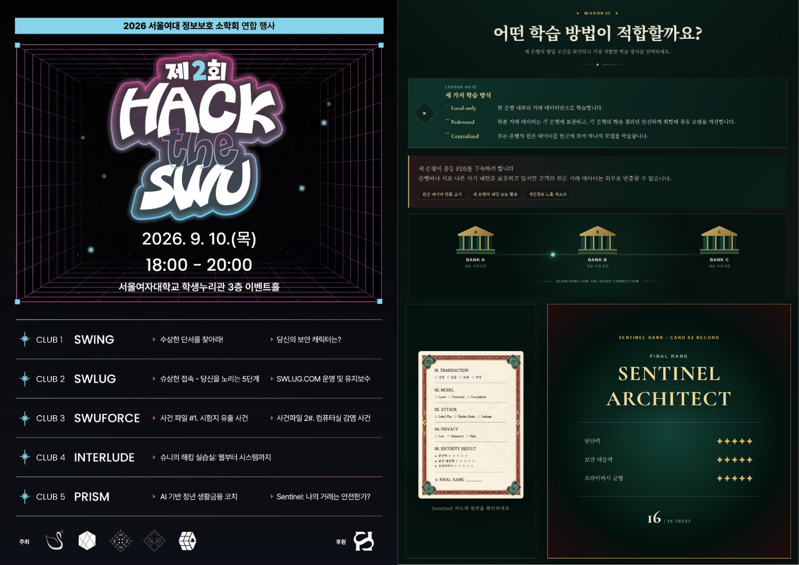

  

  <a href="https://sonotri.github.io/Sentinel_HTS/"><strong>Sentinel Bank 시작하기</strong></a>

 

## 🏦 프로젝트 소개

**Sentinel Bank**는 금융 이상거래 탐지와 개인정보보호형 연합학습 개념을 쉽고 재미있게 전달하기 위해 제작한 웹 기반 보안 체험 콘텐츠입니다.

플레이어는 **Sentinel Bank의 보안 조사관**이 되어 거래 원장의 위험 신호를 분석하고, 세 은행에 적합한 공동 학습 방식과 모델 공격 대응책을 선택합니다. 모든 임무를 완료하면 판단력·보안 대응력·프라이버시 균형을 바탕으로 최종 조사관 등급이 수여됩니다.

 

## 🎮 플레이 방식

- Sentinel 카드를 발급받고 보안국에 입장합니다.
- 거래 시간·위치·기기·IP 등 위험 신호를 분석해 승인 여부를 결정합니다.
- 세 은행의 협업 조건에 가장 적합한 학습 방식을 선택합니다.
- 비정상 모델 업데이트의 흔적을 보고 공격 유형을 추리합니다.
- 탐지 성능과 개인정보보호 사이에서 적절한 보호 수준을 결정합니다.
- 모든 임무를 완료하면 최종 등급과 핵심 보안 개념을 확인할 수 있습니다.

 

## 📜 보안 시나리오

각 임무는 실제 금융 보안 위협과 개인정보보호 개념을 바탕으로 직접 기획·개발했습니다.

- 이상거래탐지시스템(FDS)과 거래 위험 신호 분석
- Local-only·Federated·Centralized 학습 방식 비교
- 원본 데이터를 공유하지 않는 연합학습
- Label Flip·Update Scale 모델 포이즈닝 공격
- Gradient Leakage와 학습 정보 노출 위험
- Differential Privacy와 탐지 성능의 균형

플레이어가 금융 보안 의사결정을 직접 수행하면서 연합학습의 필요성과 안전한 AI 모델 운영 원칙을 자연스럽게 익힐 수 있도록 구성했습니다.

 

## 제작

<table align="center">
  <tr>
    <td align="center" width="240">
      <a href="https://github.com/sonotri">
         
        <strong>sonotri</strong>
      </a> 
      Planning · Development · Design · Operations
    </td>
    <td align="center" width="240">
       
      <a href="https://github.com/hayj9022"><strong>hayj9022</strong></a> 
      Development · Operations
    </td>
  </tr>
</table>
